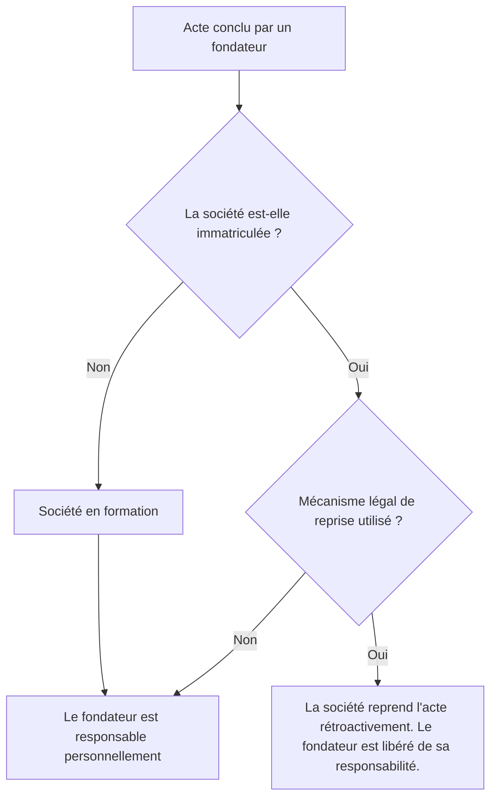

# Fiche de Révision DSCG : Le Contrat de Société et la Personnalité Morale

## I. Les Conditions de Validité du Contrat de Société (Art. 1832 du Code civil)

### A. Les Conditions Générales du Contrat (Art. 1128 C. civ.)
1. **Consentement** : Doit être exempt de vices (erreur, dol, violence). En droit des sociétés, l'erreur sur la personne (intuitu personae) ou sur la forme est retenue. La simulation (société fictive, prête-nom) est sanctionnée par la nullité (sans rétroactivité).
2. **Capacité** : 
   - **Mineurs** : Possible avec représentant légal (SARL/SA), interdiction absolue si la capacité commerciale est requise (SNC).
   - **Époux** : L'apport d'un bien commun nécessite l'information du conjoint (Art. 1832-2) qui peut revendiquer 50% des parts acquises (sauf renonciation définitive). Défaut d'information = nullité de l'apport.
3. **Objet Social** : Doit être licite et déterminé. Il délimite la capacité juridique de la personne morale (principe de spécialité) et le pouvoir de représentation des dirigeants à l'égard des tiers.

### B. Les Conditions Spécifiques au Contrat de Société
1. **La Pluralité d'associés** : En principe 2 minimum, sauf exceptions légales (EURL, SASU). En cours de vie sociale, la réunion des parts en une seule main n'entraîne pas la dissolution immédiate (délai de régularisation d'un an, prorogeable 6 mois).
2. **Les Apports** : Ils forment le capital social (sauf l'apport en industrie).
   - *Numéraire* : Somme d'argent (souscription / libération). Distinction stricte avec les comptes courants d'associés (qui sont des prêts remboursables).
   - *Nature* : Biens corporels/incorporels. S'il y a apport d'un fonds de commerce, la société est caution solidaire du passif (sauf formalités de publicité et d'opposition).
   - *Industrie* : Savoir-faire, travail, crédit. Ne concourt pas au capital social (insaisissable) mais donne droit aux bénéfices et aux droits de vote. Égal à la part de l'associé qui a le moins apporté (sauf clause contraire).
3. **La Participation aux Résultats** :
   - Partage des bénéfices et contribution aux pertes (proportionnel aux apports en principe).
   - **Prohibition des clauses léonines** : Sont réputées non écrites les clauses attribuant la totalité des profits à un associé ou l'exonérant totalement des pertes.
4. **L'Affectio Societatis** : Volonté de collaborer de façon effective, sur un pied d'égalité et intéressée. Élément clé utilisé par les juges pour distinguer la société d'un contrat de travail ou d'un prêt, et pour qualifier une société créée de fait.

> [!NOTE] Rappel DCG
> **Apports et Commissaire aux Apports (CAA)**
> - **SA / SAS** : CAA obligatoire pour tout apport en nature.
> - **SARL** : CAA obligatoire sauf si : décision unanime des associés ET valeur de chaque apport en nature < 30 000 € ET valeur totale des apports en nature < 50% du capital. Si les associés écartent le rapport du CAA, ils sont solidairement responsables de la valeur attribuée pendant 5 ans.
> - **Libération des apports en numéraire** :
>   - SARL : minimum 20% à la constitution (solde dans les 5 ans).
>   - SA / SAS : minimum 50% à la constitution (solde dans les 5 ans).

## II. La Personnalité Morale de la Société

La personnalité morale est acquise à compter de l'immatriculation au Registre du Commerce et des Sociétés (RCS), via le guichet unique électronique.

### A. La Période de Formation et Reprise des Actes
Avant immatriculation, la société est dite "en formation". Les fondateurs agissant au nom de la société sont tenus personnellement, solidairement (société commerciale) ou conjointement (société civile) des actes passés.
**Mécanismes de reprise des engagements (avec effet rétroactif à la création) :**
1. Signature des statuts avec en annexe l'état des actes accomplis.
2. Mandat exprès et déterminé donné à l'un des fondateurs avant l'immatriculation.
3. Décision expresse à la majorité des associés prise après immatriculation.

### B. Les Attributs de la Personnalité Morale
- **Dénomination sociale** : Nom de la société, protégeable, modifiable (décision AGE).
- **Siège social** : Domicile juridique. Détermine la nationalité de la société, la loi applicable et la juridiction compétente. Le siège réel prime sur le siège statutaire pour la protection des tiers.
- **Patrimoine social** : Distinct de celui des associés (gage exclusif des créanciers dans les sociétés à risque limité).
- **Capacité pénale** : La personne morale peut être pénalement responsable des infractions commises pour son compte par ses organes ou représentants légaux (Art. 121-2 du Code pénal).

### C. Sanctions et Nullités
Les cas de nullité sont limités (défaut d'affectio societatis, objet illicite, etc.). Par sécurité juridique, l'effet de la nullité agit sans rétroactivité (elle produit les effets d'une dissolution). Une action en régularisation est presque toujours possible.

## III. Les Sociétés Sans Personnalité Morale

Certaines sociétés ne sont jamais immatriculées et restent à l'état de pur contrat (elles n'ont pas de patrimoine propre).

| Caractéristique | Société en Participation (SEP) | Société Créée de Fait (SCF) |
|---|---|---|
| **Origine** | Volontaire (choix délibéré des associés) | Comportementale (les associés s'ignorent juridiquement) |
| **Immatriculation** | Non (Art. 1871 C. civ.) | Non |
| **Preuve** | Libre | Faisceau d'indices (cumul: apports, affectio societatis, partage des résultats) |
| **Responsabilité (Tiers)**| Gérant engagé seul (si occulte). Si la SEP est révélée : les associés deviennent solidaires (commerciale) ou conjoints (civile). | Associés tenus indéfiniment (solidairement si commerciale, conjointement si civile). |

## IV. Cas Pratique et Comparaison : SARL vs SAS

> [!NOTE] Rappel DCG
> **Quorums et Majorités en Assemblées**
> - **SARL (AGO)** : Majorité absolue (50% + 1 part) sur 1ère convocation. Majorité relative sur 2ème convocation (sauf clause statutaire contraire). Pas de quorum exigé.
> - **SARL (AGE)** : Quorum d'un quart (1/4) sur 1ère convocation, un cinquième (1/5) sur 2ème. Majorité obligatoire des 2/3 des parts présentes ou représentées.
> - **SAS** : Très grande liberté statutaire. La loi n'impose ni quorum ni majorité (sauf pour certaines décisions imposant l'unanimité ou visées par la loi). Ce sont les statuts qui fixent librement les conditions de vote et de consultation.

### Synthèse pour le choix de la forme juridique :
Dans un projet de constitution de société, l'arbitrage entre SARL et SAS dépend souvent des facteurs suivants :
- **Souplesse vs Sécurité** : La SAS offre une liberté contractuelle optimale (aménagement de la direction, création d'actions de préférence), idéale pour un projet évolutif avec des profils d'associés très différents. La SARL offre un cadre légal très structuré, plus protecteur mais plus rigide.
- **Direction de l'entreprise** : 
  - *SARL* : Gérant (obligatoirement une personne physique). 
  - *SAS* : Président (peut être une personne physique ou morale).
- **Transformation** : La transformation ultérieure d'une SARL en SAS est contraignante car elle exige **l'unanimité** des associés et l'intervention d'un Commissaire à la Transformation.
- **Commissaire aux Comptes (CAC)** : En l'absence de dépassement de 2 des 3 seuils légaux (Bilan, CA, Effectifs) ou d'intégration à un groupe, aucune des deux formes ne requiert la nomination d'un CAC dès la constitution.
