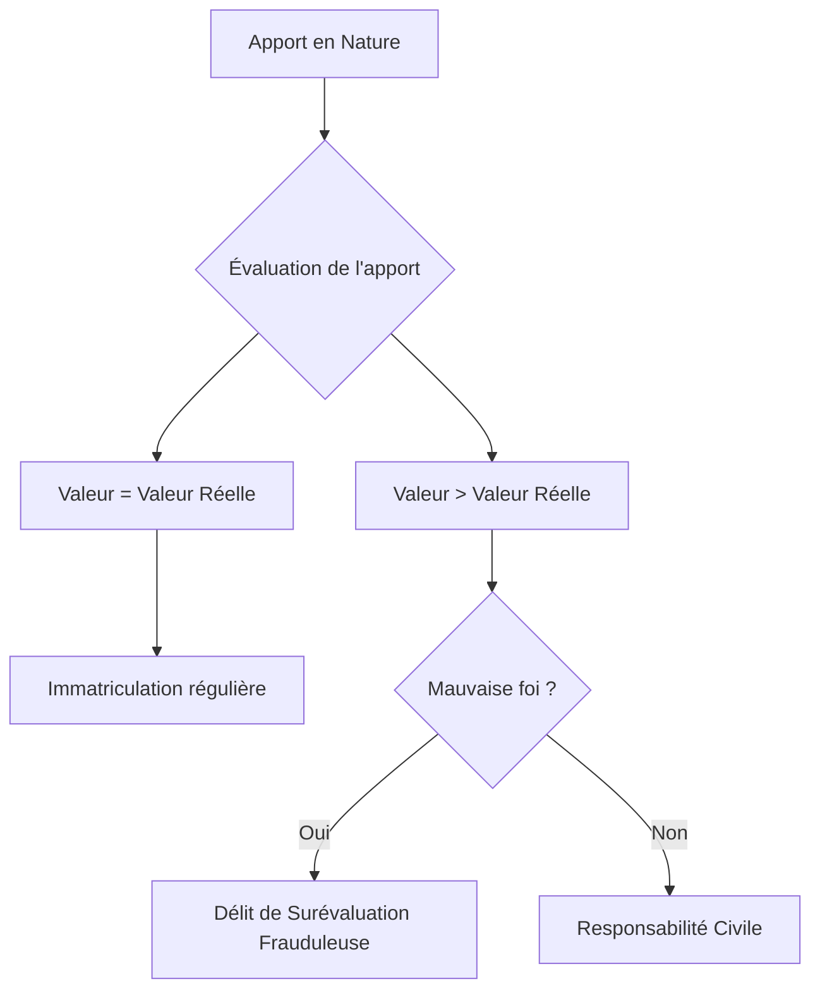
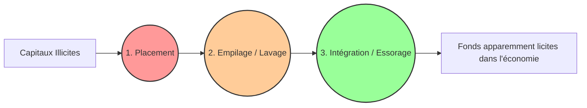

# Fiche de Révision DSCG : Droit Pénal des Sociétés Commerciales et des Affaires

Cette fiche de synthèse regroupe les principales infractions pénales applicables aux différentes étapes de la vie des sociétés commerciales (constitution, fonctionnement, modification du capital) ainsi que les infractions spécifiques aux affaires (blanchiment, infractions boursières).

---

## I. Les infractions relatives à la constitution des sociétés

### 1. La publicité et le Registre du Commerce et des Sociétés (RCS)
- **Usage irrégulier de qualité (Art. 433-8 du Code pénal)** : Fait par le dirigeant ou fondateur de faire figurer dans une publicité le nom d'une personne avec sa qualité (membre du gouvernement, magistrat, fonctionnaire, etc.) pour inspirer confiance.
  - *Peine* : 6 mois d'emprisonnement et 7 500 €.
- **Défaut d'immatriculation (Art. L123-3 C. com.)** : Pas de sanction pénale directe. Injonction de faire sous astreinte par le juge.
- **Fourniture d'informations incomplètes ou inexactes au RCS (Art. L123-5 C. com.)** : Fait de donner de mauvaise foi des indications fausses en vue d'une immatriculation ou radiation.
  - *Peine* : 6 mois et 4 500 €. Peine complémentaire : privation des droits de vote/éligibilité (Tribunaux de commerce, CCI, etc.) pour 5 ans max.

### 2. La constitution du capital social
> [!NOTE] Rappel DCG : La constitution du capital
> - **SARL** : Le capital est librement fixé. Libération de 20% minimum à la constitution, le solde dans les 5 ans.
> - **SA** : Capital minimum de 37 000 €. Libération de 50% minimum à la constitution, le solde dans les 5 ans.
> - Les apports en nature doivent faire l'objet d'une évaluation (Commissaire aux Apports, obligatoire dans les SA, sous conditions dans les SARL).

- **Émission et négociation illicites d'actions / parts sociales** :
  - *SARL* (Art. L241-2) : Émission de valeurs mobilières (ex: obligations hors conditions légales). Peine : 6 mois et 9 000 €.
  - *SA, SCA, SAS* (Art. L242-1) : Émettre/négocier des actions sans libération légale à la souscription (moitié numéraire ou intégralité apports). Amende : 150 000 € (double si offre au public).
- **Délit de surévaluation des apports en nature** : Fait pour toute personne d'attribuer frauduleusement (mauvaise foi) à un apport une évaluation supérieure à sa valeur réelle.
  - *SARL* : 5 ans et 375 000 €.
  - *SA* : 5 ans et 9 000 €.

---

## II. Les infractions relatives au fonctionnement des sociétés

### 1. Les infractions comptables et financières
Ces délits, fondamentaux en DSCG, sanctionnent les dirigeants (de droit ou de fait) qui présentent une fausse image de l'entreprise.

- **Délit de présentation ou publication de comptes annuels infidèles** : Fait de publier ou présenter aux associés/actionnaires, même sans distribution de dividendes, des comptes ne donnant pas une image fidèle, en vue de dissimuler la véritable situation de la société.
- **Délit de distribution de dividendes fictifs** : Fait d'opérer la répartition de dividendes fictifs en l'absence d'inventaire ou sur la base d'un inventaire frauduleux. L'infraction est intentionnelle (mauvaise foi).

> [!NOTE] Rappel DCG : Les dividendes et l'affectation du résultat
> Les dividendes ne peuvent être prélevés que sur un **bénéfice distribuable** (Résultat de l'exercice - pertes antérieures - dotations aux réserves + report à nouveau créditeur). L'AGO doit approuver les comptes dans les 6 mois de la clôture de l'exercice avant toute distribution.

*Peines pour ces deux délits (SARL, SA, SCA, SAS)* : **5 ans d'emprisonnement et 375 000 € d'amende**. (Prescription de 6 ans).

### 2. Les infractions liées aux assemblées et aux droits sociaux
> [!NOTE] Rappel DCG : Quorums et Majorités
> - **AGO (SA)** : Quorum de 20% (1ère convocation), aucun sur la 2ème. Majorité des voix exprimées.
> - **AGE (SA)** : Quorum de 25% (1ère), 20% (2ème). Majorité des 2/3.

- **Non-établissement ou non-présentation des documents annuels** :
  - *SARL/SA* : Ne pas dresser l'inventaire, les comptes et le rapport de gestion. Amende de 9 000 €.
  - *SA* : Ne pas soumettre ces documents à l'AGOA. Peine : 6 mois et 9 000 €. (La SARL encourt seulement 9 000 €).
- **Entrave à la participation aux assemblées (Actionnaires et Obligataires)** : Fait d'empêcher un actionnaire/obligataire de participer, ou de garantir des avantages pour orienter un vote. Peine : 2 ans et 9 000 €.
- **Détention illégale d'actions à dividende prioritaire** : Par les dirigeants de SA. Amende : 150 000 €.

---

## III. Les infractions relatives aux modifications du capital

- **Augmentation du capital (SA, SCA, SAS)** : Émission d'actions sans que le capital précédent ait été intégralement libéré ou non-libération du quart du numéraire à la souscription. Amende : 150 000 €.
- **Indications inexactes (Droit Préférentiel de Souscription)** : Dirigeants ou CAC donnant des indications inexactes pour justifier la suppression du DPS. Peine : 2 ans et 18 000 €.
- **Réduction du capital** : Dirigeants procédant à une réduction sans respecter l'égalité des actionnaires. Amende : 30 000 €.
- **Spécificité SAS** : Dirigeant omettant de consulter les associés (selon statuts) pour toute modification structurelle (augmentation, réduction, fusion, scission). Peine : 6 mois et 7 500 €.

---

## IV. Le contrôle des sociétés : Le Commissaire aux Comptes (CAC)

> [!NOTE] Rappel DCG : Le Commissaire aux Comptes
> La nomination d'un CAC est obligatoire en cas de franchissement de 2 des 3 seuils : Total Bilan de 4 M€, CA HT de 8 M€, 50 salariés.
> Le CAC exerce une obligation de **moyens** dans ses contrôles, mais une obligation de **résultat** concernant l'indépendance, le secret professionnel et la révélation des faits délictueux.

- **Exercice illégal et violation du secret professionnel** : 1 an et 15 000 €.
- **Entrave au contrôle du CAC** : Ne pas provoquer sa désignation, ne pas le convoquer aux AG (2 ans et 30 000 €). Faire obstacle à ses vérifications ou refuser de lui transmettre les pièces (5 ans et 75 000 €).
- **Délits commis par le CAC** :
  - Donner ou confirmer des informations mensongères sur la société.
  - **Non-révélation de faits délictueux** au Procureur de la République.
  - *Peine* : 5 ans et 75 000 €.

---

## V. Les autres infractions du monde des affaires

### 1. Le délit de blanchiment (Art. 324-1 du Code pénal)
Le blanchiment est le fait de faciliter, par tout moyen, la justification mensongère de l'origine des biens/revenus tirés d'un crime ou délit.

- **Blanchiment simple** : 5 ans et 375 000 €.
- **Blanchiment aggravé** (habituel, profession, bande organisée) : 10 ans et 750 000 €.

### 2. Le droit pénal des marchés financiers
- **Délit d'initié** : Fait, pour un initié (dirigeants, professionnels, etc.), d'utiliser ou communiquer une information privilégiée pour réaliser des opérations financières avant que l'information soit publique.
- **Manipulation de cours** : Fait de donner des indications trompeuses sur l'offre/la demande pour fixer le cours à un niveau anormal ou artificiel.
- **Sanctions maximales** : 5 ans d'emprisonnement et 100 millions d'euros d'amende (pouvant être portée jusqu'au décuple de l'avantage retiré).

---

## Tableau de Synthèse des Principales Peines (À connaître)

| Infraction | Auteur(s) visé(s) | Peine d'emprisonnement | Amende |
| :--- | :--- | :--- | :--- |
| **Défaut d'immatriculation** | Commerçant | - | Injonction (juge) |
| **Surévaluation apports (SARL)** | Toute personne / CAA | 5 ans | 375 000 € |
| **Surévaluation apports (SA)** | Toute personne / CAA | 5 ans | 9 000 € |
| **Comptes annuels infidèles** | Dirigeants | 5 ans | 375 000 € |
| **Distribution dividendes fictifs**| Dirigeants | 5 ans | 375 000 € |
| **Blanchiment simple** | Toute personne | 5 ans | 375 000 € |
| **Entrave au CAC** | Dirigeants | 5 ans | 75 000 € |
| **Non-révélation faits délictueux**| CAC | 5 ans | 75 000 € |
| **Délit d'initié** | Initiés | 5 ans | 100 M€ (ou décuple profit) |

