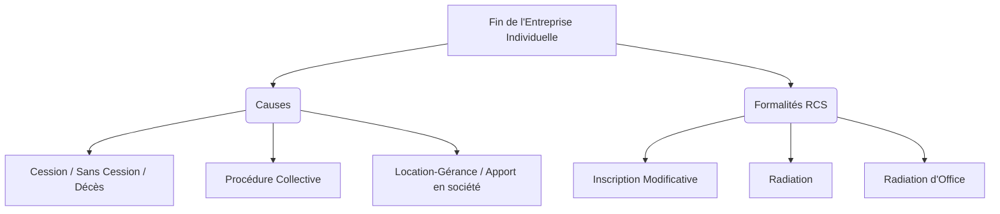
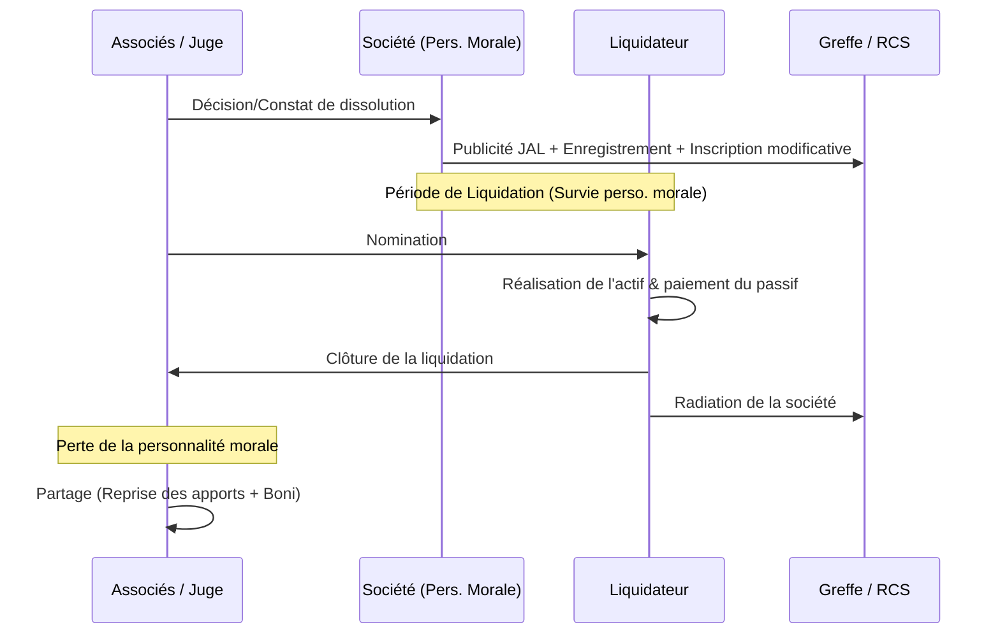

# Fiche de Révision DSCG : La Fin de l'Entreprise

Cette fiche synthétise les règles juridiques applicables à la fin de vie des entreprises, qu'il s'agisse d'une entreprise individuelle (cessation) ou d'une société (dissolution).

---

## I. La Cessation de l'Activité de l'Entreprise Individuelle (EI)

La fin d'une entreprise individuelle est marquée par la cessation de son activité.

### 1. Les causes de cessation

*   **Cession de l'entreprise :**
    *   *À titre onéreux :* Vente du fonds de commerce ou du fonds libéral (la cession de la clientèle civile est licite).
    *   *À titre gratuit :* Entre vifs (donation) ou à cause de mort (legs).
*   **Cessation sans cession :** Vente isolée des éléments du fonds.
    *   *Liquidation des stocks :* Soumise à autorisation préfectorale (max. 2 mois). Possibilité de revente à perte.
    *   *Cession du droit au bail :* Libre si l'activité est identique, soumise à autorisation du bailleur si changement d'activité. (Attention : la cession de "pas-de-porte" seul peut être interdite par le bail).
*   **Décès de l'entrepreneur :** Transmission aux héritiers.
*   **Liquidation judiciaire :** Conséquence de la cessation des paiements et de l'impossibilité manifeste de redressement.
*   **Mise en gérance libre (Location-gérance) :** Le propriétaire concède l'exploitation à un gérant. Entraîne la perte de la qualité de commerçant pour le loueur exploitant.
*   **Apport du fonds en société :** Transfert de propriété en échange de droits sociaux (parts ou actions). Évaluation par un Commissaire aux Apports (CAA) requise dans certaines sociétés (SARL, SA).

### 2. Les formalités au RCS

*   **Inscriptions modificatives :** Cessation partielle, cessation totale temporaire ou définitive (avec possibilité de maintien provisoire de l'immatriculation d'un an max), décès (avec maintien provisoire), renonciation à l'EIRL.
*   **Radiation :** Cessation totale définitive, décès (sans maintien provisoire). À effectuer dans le mois précédant ou suivant la cessation.
*   **Radiation d'office :** Interdiction d'exercer, décès (après 1 an), clôture de liquidation pour insuffisance d'actif, cessation d'activité depuis plus d'un an.
*   **Sanctions :**
    *   Injonction sous astreinte.
    *   Indications inexactes de mauvaise foi : 4 500 € d'amende et 6 mois d'emprisonnement.
    *   Inopposabilité aux tiers (sauf s'ils en ont eu personnellement connaissance).

---

## II. La Dissolution de la Société

### 1. Les causes de dissolution

#### A. Causes communes à toutes les sociétés (Art. 1844-7 C. civ)
*   **Expiration de la durée de vie :** (Max 99 ans). Dissolution de plein droit si aucune prorogation n'est votée.
*   **Réalisation ou extinction de l'objet social :** Dissolution de plein droit.
*   **Dissolution anticipée volontaire :** Décidée par les associés.
*   **Dissolution judiciaire pour justes motifs :** Inexécution des obligations, ou **mésentente grave** paralysant le fonctionnement (le demandeur ne doit pas être fautif).
*   **Annulation du contrat de société.**
*   **Liquidation judiciaire :** Clôture pour insuffisance d'actif.
*   **Causes statutaires.**

> [!NOTE] Rappel DCG - Procédures et Majorités (Dissolution Anticipée)
> La dissolution anticipée entraîne une modification des statuts. Les conditions de vote dépendent de la forme de la société :
> *   **SARL :** 
>     * Création avant 04/08/2005 : Majorité des ¾ des parts (pas de quorum).
>     * Création après 04/08/2005 : Quorum d'1/4 sur 1ère convocation, 1/5 sur 2ème ; Majorité des 2/3 des voix présentes ou représentées.
> *   **SA (AGE) :** Quorum d'1/4 (1ère convocation) ou 1/5 (2ème). Majorité des 2/3 des voix exprimées.
> *   **SNC / Société Civile :** Unanimité (sauf clause contraire dans les statuts).
> *   **SAS :** Règles fixées librement par les statuts.

#### B. La réunion de toutes les parts en une seule main
N'entraîne pas la dissolution de plein droit. L'associé a 1 an pour régulariser la situation (trouver de nouveaux associés). Au-delà, tout intéressé peut demander la dissolution.

| Qualité de l'associé unique | Conséquence de la dissolution |
| :--- | :--- |
| **Personne physique** | Entraîne la **liquidation** de la société. |
| **Personne morale** | **Pas de liquidation**. Entraîne la **Transmission Universelle du Patrimoine** (TUP) à l'associé unique. |

#### C. Causes spécifiques de dissolution

| Forme | Causes spécifiques |
| :--- | :--- |
| **SEP** | Notification d'un associé (si durée indéterminée). |
| **Société Civile** | Absence de gérant > 1 an ; Révocation/Décès/Incapacité d'un associé (si prévu par les statuts). |
| **SNC** | Décès d'un associé, interdiction/incapacité (sauf clause contraire) ; Révocation du gérant (sous conditions). |
| **SARL** | Dépassement 100 associés (après 1 an de régularisation) ; Capitaux propres < ½ Capital social. |
| **SA** | Capital inférieur au minimum légal ; Moins de 2 ou 7 actionnaires ; Capitaux propres < ½ Capital social. |

---

### 2. Procédure et Effets de la Dissolution

#### A. Publicité
L'opposabilité aux tiers nécessite :
1. Enregistrement de l'acte (Droit fixe 375€, ou 500€ si capital ≥ 225 000€).
2. Avis dans un Journal d'Annonces Légales (JAL).
3. Dépôt au CFE/Greffe pour inscription au RCS et mention au BODACC.

#### B. Survie provisoire de la personnalité morale
*   **Principe :** La personnalité morale subsiste **pour les besoins de la liquidation** jusqu'à la publication de la clôture.
*   **Conséquences :** La société reste seule débitrice de ses dettes, conserve son patrimoine, mais ne peut pas débuter de nouvelles activités.
*   **Possibilité de restructuration :** Une société en liquidation peut participer à une fusion ou scission.

#### C. Opérations de liquidation
*   **Le Liquidateur :** Nommé par les statuts, les associés ou le juge. Mandat de 3 ans (renouvelable dans les sociétés commerciales). Représente la société à l'égard des tiers.
*   **Missions :** Réaliser l'actif et apurer le passif. Pas de discipline collective pour les créanciers si pas en état de cessation des paiements (paiement au "prix de la course", avec respect des privilèges si liquidateur professionnel). Dépôt de bilan obligatoire en cas de cessation des paiements.
*   **Clôture :** Demande de radiation au RCS dans le mois de la publication de la clôture (sinon, radiation d'office après 3 ans).

#### D. Le Partage
Intervient après la perte de la personnalité morale (les associés sont en indivision).
1.  **Reprise des apports :** Chaque associé reprend son apport (hors apports en industrie qui ne peuvent être repris ni remboursés). Attribution préférentielle possible.
2.  **Partage du boni de liquidation :** L'actif net restant (boni) est réparti proportionnellement aux droits des associés (sauf clause contraire dans les statuts).

