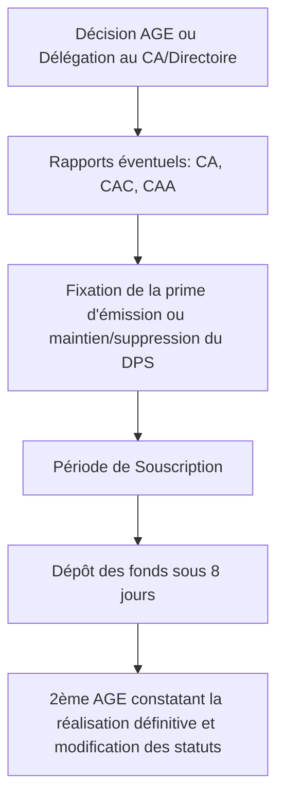

# Fiche de Révision DSCG : Le Financement

## I. Financement par Capitaux Propres : L'Augmentation de Capital

L'augmentation de capital permet de lever des fonds propres essentiels à la croissance de l'entreprise et sécurise les tiers.

### 1. Typologie et Conditions des Augmentations de Capital

| Type d'Apport | Conditions préalables | Libération des parts / actions (SA et SARL) |
|---|---|---|
| **Numéraire** | Capital initial intégralement libéré | Minimum 1/4 à la souscription, le solde dans les 5 ans |
| **Nature** | Aucune condition de libération du capital initial | Libération immédiate et intégrale ; Intervention d'un Commissaire aux Apports (CAA) |
| **Incorporation de réserves** | Aucune condition de libération du capital initial | Virement comptable (création d'actions gratuites ou élévation de la valeur nominale) |
| **Compensation de créances** | Créances liquides et exigibles | Libération immédiate |

> [!NOTE] Rappel DCG
> **Quorum et Majorités pour les Augmentations de Capital (AGE)**
> - **Numéraire ou Nature (SA) :** Quorum de 1/4 sur 1ère convocation, 1/5 sur 2ème. Majorité des 2/3 des voix.
> - **Numéraire ou Nature (SARL > 04/08/2005) :** Quorum de 1/4 sur 1ère, 1/5 sur 2ème. Majorité des 2/3 des parts sociales.
> - **Incorporation de réserves :** Majorité simple des présents/représentés en SA (comme une AGO mais reste une AGE) et majorité des parts sociales en SARL.
> - **Élévation de la valeur nominale :** Accord unanime des associés car augmentation de leurs engagements.

### 2. Procédure et Protection des Actionnaires

Pour éviter la dilution des anciens actionnaires (financière et politique), deux mécanismes existent :
- **Le Droit Préférentiel de Souscription (DPS) :** Droit irréductible et négociable. L'AGE peut le supprimer sur rapport du CA et du CAC (ex: pour faire entrer un tiers).
- **La Prime d'émission :** Droit d'entrée compensant la différence entre la valeur nominale et la valeur réelle de l'entreprise.

## II. Le Pacte d'Actionnaires

Convention sous seing privé (soumise au droit commun des contrats) organisant les relations entre associés et la gouvernance, en complétant les statuts.

**Principales Clauses :**
- **Gouvernance :** Information renforcée, consultation préalable pour décisions stratégiques, clause de *bad leaver*.
- **Maintien de la valorisation :** Clause *ratchet* (clause anti-dilution permettant aux investisseurs de souscrire à de nouvelles actions pour une valeur symbolique afin de maintenir leur pourcentage en cas de baisse de valorisation).
- **Évolution de l'actionnariat :**
  - *Tag along* (sortie conjointe : le minoritaire peut exiger que ses parts soient rachetées aux mêmes conditions).
  - *Drag along* (sortie forcée : oblige les minoritaires à vendre si le majoritaire vend).
  - *Buy or Sell* (clause texane : A propose à B de racheter ses parts à un prix, B doit accepter ou bien racheter celles de A au même prix).
  - *Earn-out* (complément de prix conditionné aux performances futures).

**Sanction de l'inexécution :**
Le pacte n'est opposable qu'aux signataires. S'agissant d'obligations de faire ou de ne pas faire (art. 1217 du Code civil), la sanction principale en cas d'inexécution ou de cession frauduleuse (si le tiers est de bonne foi) est souvent cantonnée à l'allocation de dommages et intérêts, ce qui montre la fragilité du dispositif.

## III. Le Financement par Comptes Courants d'Associés (CCA)

Avances en compte courant constituant une créance de l'associé sur la société.
- **Avantages :** Intérêts déductibles du bénéfice de l'entreprise, grande souplesse financière, pas de dilution du pouvoir, consolide la surface financière sans procédure lourde d'augmentation de capital. Ne viole pas le monopole bancaire des opérations de crédit.
- **Limites et Interdictions strictes :** Interdiction absolue (sous peine de nullité) d'avoir un compte courant débiteur (c'est-à-dire emprunter à la société) pour les dirigeants et associés personnes physiques dans les SARL/SA/SAS, ainsi que pour leurs conjoints et ascendants/descendants.
- **Conventions réglementées :** Les CCA portant intérêts dans les SA conclus avec des administrateurs, dirigeants ou actionnaires > 10% nécessitent une autorisation préalable du CA et le contrôle du CAC.

## IV. Financement par le Marché Financier et Emprunts

### 1. Accès au Marché
- **Offre au Public de Titres Financiers (OPTF) :** Placement pour souscription.
- **Procédures d'introduction en Bourse :** OPO (Offre à Prix Ouvert, la plus utilisée), OPF (Prix Ferme), OPM (Prix Minimal), Cotation directe.
- **Transparence :** Déclaration obligatoire de franchissement de seuils en hausse ou en baisse (5, 10, 15, 20, 25, 30%). OPA obligatoire au franchissement du seuil de 30%.

### 2. Les Obligations et Titres Hybrides
- **Obligations classiques :** Titre de créance à long terme. Possibilité d'obligations "à coupon zéro" (aucun intérêt perçu en cours de vie mais capitalisation pour une forte prime de remboursement) ou de remboursements *in fine*.
- **OAT (Obligations Assimilables du Trésor) :** Émises par l'État par adjudication.

**Tableau des Valeurs Mobilières donnant accès au capital :**

| Titre Hybride | Description et Intérêt |
|---|---|
| **OCA (Obligations Convertibles en Actions)** | Obligation + Option de conversion. L'obligataire a le choix de convertir sa créance en actions si le cours devient favorable. Avantageux car taux d'intérêt souvent plus faible. |
| **OBSA (Obligations à Bons de Souscription d'Actions)** | Obligation + Bon détachable et négociable séparément. Le bon permet de souscrire ultérieurement à de nouvelles actions à un prix fixé. |
| **ORA (Obligations Remboursables en Actions)** | Remboursement inéluctable en actions. Ce ne sont plus vraiment des titres hybrides car la transformation en fonds propres est certaine. |

## V. Les Garanties et Sûretés liées au Financement

Face aux risques d'insolvabilité, les prêteurs (banques) exigent des garanties, particulièrement de la part des dirigeants de PME.

### 1. Le Cautionnement (Garantie personnelle)
Sûreté accessoire par laquelle une caution s'oblige envers le créancier à payer la dette du débiteur principal en cas de défaillance.

> [!NOTE] Rappel DCG
> **Règles Essentielles du Cautionnement (Réforme 2022) :**
> - **Formalisme (Art. 2297 C. civ) :** À peine de nullité, la caution personne physique doit apposer elle-même la mention indiquant précisément le montant (en chiffres et en lettres) et l'étendue de son engagement, même à l'égard des créanciers professionnels.
> - **Disproportion (Art. 2300 C. civ) :** Si le cautionnement souscrit envers un professionnel est manifestement disproportionné aux revenus/patrimoine de la caution lors de sa conclusion, il n'est plus nul, mais **réduit** au montant que la caution pouvait supporter à cette date.
> - **Nature de l'acte :** Le cautionnement d'une dette commerciale par un dirigeant est désormais un acte de commerce.

*Alternative : La Garantie Autonome (art. 2321 C. civ), engagement du garant de payer à première demande, sans pouvoir opposer d'exceptions liées à l'obligation principale (contrairement au caractère accessoire du cautionnement).*

### 2. Le Gage et le Droit de Rétention (Garanties réelles)
- **Gage :** Sûreté réelle conventionnelle sur un bien meuble (avec ou sans dépossession, ex: gage sur stocks).
- **Droit de rétention (Art. 2286 C. civ) :** Droit redoutable de conserver un bien jusqu'au complet paiement, opposable à tous.
- **Conflits de Sûretés (Art. 2340 C. civ) :** En présence d'un gage *sans dépossession* antérieur (et régulièrement publié), ce droit de préférence est opposable à un créancier gagiste *avec dépossession* postérieur, nonobstant le droit de rétention matériel de ce dernier.
