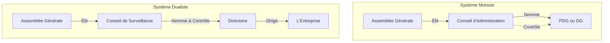

# Fiche de Révision DSCG : Gouvernance d'Entreprise

## 1. Introduction et Enjeux de la Gouvernance

La **gouvernance d'entreprise** (*Corporate Governance*) désigne le système par lequel les sociétés sont dirigées et contrôlées. Elle vise à réguler les relations entre les dirigeants, les actionnaires (propriétaires) et les autres parties prenantes.

*   **Objectifs :** Promouvoir la séparation et l'équilibre des pouvoirs, ainsi que la transparence du fonctionnement des sociétés.
*   **Théorie de l'agence (Berle & Means / Jensen & Meckling) :** Dissociation entre les propriétaires (actionnaires / principal) et les dirigeants (experts / agent), générant de possibles conflits d'intérêts et une perte d'information pour les propriétaires.
*   **Loi PACTE (2019) :**
    *   La société est gérée dans son **intérêt social**, en prenant en considération les **enjeux sociaux et environnementaux**.
    *   Possibilité d'inscrire une **raison d'être** dans les statuts (art. 1835 C. civ).
    *   Création de la **société à mission** (objectifs sociaux/environnementaux).

## 2. Le Statut et les Pouvoirs des Dirigeants Sociaux

### 2.1. Mise en place et types de dirigeants
*   **Dirigeants de droit :** Désignés conformément à la loi et aux statuts (ex: Gérants en SNC/SARL, Président en SAS, CA/CS/Directoire en SA).
*   **Dirigeants de fait :** Personnes assumant en fait la gestion en lieu et place des représentants légaux (engagent leur responsabilité de la même manière).

> [!NOTE] Rappel DCG
> **Les systèmes de gouvernance de la SA**
> *   **Système moniste :** Conseil d'Administration (CA) + Président Directeur Général (PDG) ou DG dissocié.
> *   **Système dualiste :** Directoire (gestion) + Conseil de Surveillance (contrôle).

### 2.2. Responsabilités des Dirigeants

| Type de responsabilité | Déclencheur / Motif | Conséquences / Actions |
| :--- | :--- | :--- |
| **Civile** | Faute de gestion, violation des statuts, non-respect des lois. | Action sociale (au nom de la société) ou action individuelle (préjudice distinct). |
| **Pénale** | Infractions (abus de biens sociaux, comptes infidèles, banqueroute). | Condamnations pénales pour le dirigeant de droit ou de fait. |
| **Fiscale** | Fraude ou inobservation grave rendant le recouvrement impossible. | Paiement personnel des impositions et pénalités de la société. |
| **Patrimoniale** | Faute de gestion ayant contribué à l'insuffisance d'actif (en cas de LJ). | Obligation de contribuer en tout ou partie au passif social. |
| **Professionnelle** | En cas de redressement ou liquidation judiciaire (LJ). | Faillite personnelle, interdiction de gérer. |

## 3. Statut, Pouvoirs et Limites des Associés/Actionnaires

Les associés disposent de droits individuels et collectifs pour contrôler les dirigeants.

### 3.1. Les droits fondamentaux
*   **Droit de communication :** Permanent (en cours d'exercice) et temporaire (avant les assemblées).
*   **Droit d'expertise de gestion :** 10% du capital en SARL, 5% en SA. Désignation d'un expert par le président du Tribunal de Commerce.
*   **Droit de déclencher l'alerte :** Questions posées par écrit aux dirigeants sur tout fait de nature à compromettre la continuité d'exploitation.
*   **Droit de vote en assemblées :** Approbation des comptes, nomination/révocation des dirigeants.

> [!NOTE] Rappel DCG
> **Règles de Quorum et Majorité dans la SA**
> 
> *   **Conseil d'Administration / de Surveillance :**
>     *   *Quorum :* La moitié au moins des membres.
>     *   *Majorité :* Majorité des membres présents/représentés.
> *   **AGO (Décisions courantes, comptes) :**
>     *   *Quorum :* 20% (1ère conv.), aucun (2ème conv.).
>     *   *Majorité :* Majorité absolue des suffrages exprimés.
> *   **AGE (Modification des statuts) :**
>     *   *Quorum :* 25% (1ère conv.), 20% (2ème conv.).
>     *   *Majorité :* 2/3 des suffrages exprimés.

### 3.2. Cession de titres et Pactes d'Actionnaires
*   La liberté de cession dépend du type de société (Intuitu personae fort en SNC/SARL).
*   **Pactes d'actionnaires (SAS, SA) :** Actes extrastatutaires (clauses d'agrément, de préemption, etc.) régis par le droit des contrats pour organiser le contrôle de la société.

## 4. Les Mécanismes de Contrôle de la Gouvernance

### 4.1. Le contrôle des Conventions (Prévention des conflits d'intérêts)

> [!NOTE] Rappel DCG
> **Typologie des conventions (SARL, SA, SAS)**
> *   **Conventions libres :** Opérations courantes à des conditions normales. Aucune procédure.
> *   **Conventions interdites :** Emprunts, cautions accordés par la société à ses dirigeants (personnes physiques). Nullité absolue.
> *   **Conventions réglementées :** Toutes les autres. Procédure stricte :
>     1. Information préalable.
>     2. Autorisation préalable (CA/CS).
>     3. Rapport spécial du CAC.
>     4. Approbation a posteriori par l'AGO (l'intéressé ne vote pas).

### 4.2. Les Acteurs du Contrôle

| Acteur | Rôle et Pouvoirs en matière de gouvernance |
| :--- | :--- |
| **Commissaire aux Comptes (CAC)** | Contrôle permanent, certification des comptes. Obligation de révélation des faits délictueux au Procureur. Déclenchement de la procédure d'alerte. |
| **Comité Social et Économique (CSE)** | Information/consultation sur la marche de l'entreprise. 2 représentants (voix consultative) au CA/CS. Droit d'alerte, appel à un expert. |
| **Organes internes spécialisés** | Dans les sociétés cotées ou grandes SA : Comités d'audit, des rémunérations et des nominations. |

## 5. Gouvernance des Sociétés Cotées : La Soft Law

*   **Origine :** Mouvement né aux USA (Loi Sarbanes-Oxley) et en Europe (Rapports Viénot, Bouton) suite à divers scandales financiers, réclamant une séparation des pouvoirs et plus d'indépendance.
*   **Code Afep-Medef :** Référentiel de gouvernement d'entreprise des grandes sociétés cotées en France.
    *   Principe **"Comply or Explain"** : Appliquer les recommandations ou justifier pourquoi la société s'en écarte.
    *   Mise en place de comités spécialisés.
    *   Politique de mixité et d'objectifs RSE (responsabilité sociale et environnementale).
    *   Principe du *"Say on pay"* : vote des actionnaires sur la rémunération des dirigeants.
*   **Code Middlenext :** Référentiel adapté pour les valeurs moyennes et petites cotées.

---
*Fiche de synthèse optimisée pour le DSCG (UE1 et UE4) basée sur la théorie de l'agence, l'évolution réglementaire (Loi PACTE) et la jurisprudence.*
