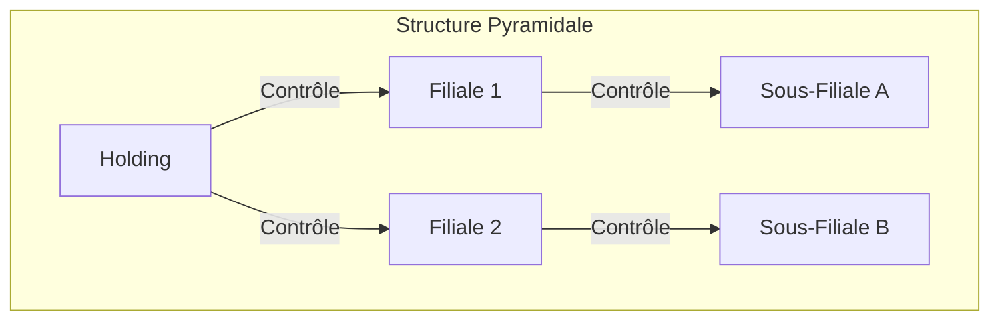
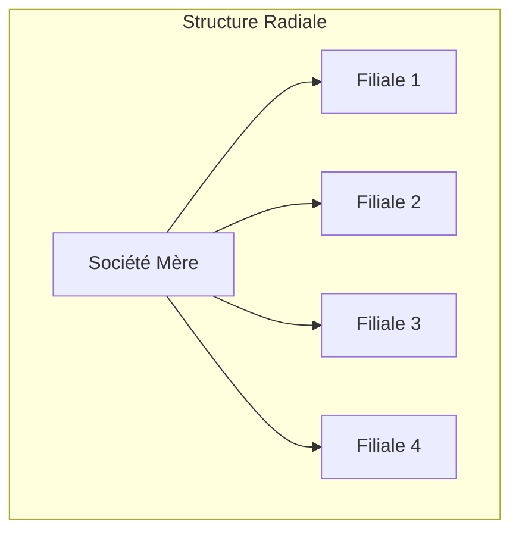
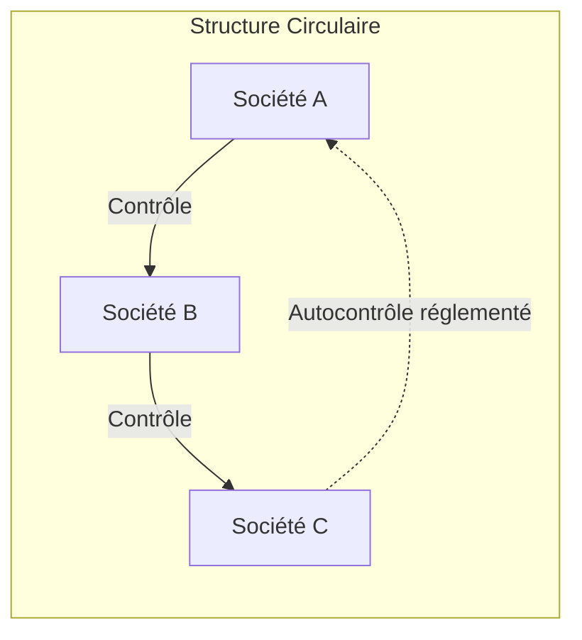

# Fiche de Révision DSCG : Constitution et Vie des Groupes de Sociétés

## I. Notion et Structuration des Groupes

Le groupe de sociétés est une notion économique sans personnalité morale propre, défini par des liens capitalistiques (contrôle) entre plusieurs sociétés indépendantes.

### 1. Les Architectures de Groupes

### 2. La Société Holding

La holding a pour rôle de détenir et gérer des participations. Ses intérêts sont multiples :
* **Déconnexion pouvoir/capital** : Permet de contrôler un groupe avec un investissement réduit (effet de levier juridique).
* **Transmission familiale** : Facilite le partage et conserve le pouvoir (donation des parts de la holding).
* **LBO (Leveraged Buy-Out)** : Rachat avec effet de levier financier, juridique et fiscal.
* **Unité de direction** : Politique commune.

**Modes de constitution :**
* **Par le haut (Apport de titres)** : Les associés apportent leurs actions à une société nouvelle (la holding) qui devient associée de la société d'exploitation.
* **Par le bas (Filialisation)** : La société d'exploitation apporte son fonds de commerce à une société nouvelle, devenant ainsi une holding gérant les titres de la nouvelle filiale.

**Choix de la forme juridique :**
* **Société Civile** : Souple, stabilité du capital, neutralité fiscale, mais responsabilité indéfinie des associés et objet civil strict.
* **SAS (Société par Actions Simplifiée)** : Très prisée. Président irrévocable possible, actions de préférence, clauses statutaires protectrices (inaliénabilité jusqu'à 10 ans, agrément total, changement de contrôle, exclusion).
* **SE (Société Européenne)** : Pour les groupes à dimension communautaire (capital minimum 120 000 €). Transfert de siège facilité.

---

## II. Prises de Participation, Contrôle et Offres Publiques

### 1. Les Notions Clés

* **Participation** : Détention comprise entre 10 % et 50 % du capital.
* **Filiale** : Détention de plus de 50 % du capital.
* **Contrôle (Art. L233-3 C. com)** : Détention directe/indirecte de la majorité des droits de vote (DV) ; accord avec d'autres associés ; contrôle de fait (détermine en fait les décisions) ; pouvoir de nommer/révoquer la majorité des dirigeants. 
  * *Présomption de contrôle :* détention de plus de 40 % des DV sans qu'aucun autre actionnaire ne détienne plus.

> [!NOTE] Rappel DCG : Quorums et Majorités
> * **SARL :** AGO (Majorité absolue puis relative au 2nd tour) / AGE (2/3 des parts).
> * **SA :** AGO (Quorum 1/5, Majorité 50%+1 des voix exprimées) / AGE (Quorum 1/4, Majorité 2/3 des voix exprimées). Minorité de blocage à 33,33 % (1/3 des voix).
> * **SAS :** Liberté statutaire totale concernant les quorums et majorités (excepté pour certaines décisions exigeant l'unanimité).

### 2. Réglementation des Participations Réciproques et Autocontrôle

L'autocontrôle porte atteinte à la réalité du capital et verrouille la révocation des dirigeants.

| Type | Définition | Réglementation & Sanctions |
|---|---|---|
| **Direct** | A détient des parts dans B, et B dans A | Maximum légal de **10 %** entre sociétés par actions (ou SA / SARL). Au-delà, aliénation dans le délai d'1 an et suspension des droits de vote pour l'excédent. |
| **Indirect** | A contrôle B qui contrôle C qui détient des parts dans A | Les actions d'autocontrôle indirect voient leurs **droits de vote supprimés** dans les AG de la société mère. Droits financiers (dividendes) maintenus. |

### 3. Transparence et Marchés Financiers (Sociétés Cotées)

* **Action de concert :** Personnes ayant conclu un accord en vue d'acquérir/céder des DV pour mettre en œuvre une politique commune (solidarité des obligations).
* **Déclaration de franchissement de seuils :** Avertir la société et l'AMF pour tout franchissement à la hausse/baisse (5%, 10%, 15%, 20%, 25%, 30%, 33,3%, 50%, 66,6%, 90%, 95%). Sanction : perte des droits de vote (automatique pour l'excédent pendant 2 ans).
* **Déclaration d'intentions :** À partir de 10% (puis 15%, 20%, 25%), l'acquéreur doit déclarer ses intentions pour les 6 mois à venir (prise de contrôle, etc.).

### 4. Les Offres Publiques (OPA/OPE)

* **Offre publique obligatoire :** Déclenchée si détention > 30 % du capital ou des droits de vote, ou si détention entre 30% et 50% avec une acquisition de plus de 1% en 12 mois. Doit porter sur 100 % du capital.
* **OPR (Offre Publique de Retrait) :** Permet aux minoritaires de sortir si le majoritaire franchit 95 % des droits de vote.
* **Retrait obligatoire :** Expropriation des minoritaires (max 5 %) suite à une OPR pour détenir 100 % de la cible.
* **Défenses anti-OPA :** Actions sans droit de vote, actions à vote double, plafonnement des DV, augmentation de capital, bons de souscription, transformation en SCA.

---

## III. Le Régime Juridique et Financier du Groupe

### 1. Indépendance Patrimoniale et Intérêt du Groupe

Chaque société a son propre patrimoine. Il n'y a pas de garantie implicite de la mère pour ses filiales, sauf :
* Garantie expresse (cautionnement, garantie autonome).
* Confusion des patrimoines ou fictivité (extension des procédures collectives).
* Immixtion de la mère (dirigeant de fait entraînant responsabilité pour insuffisance d'actif).

**L'intérêt du Groupe (Jurisprudence Rozenblum - ABS) :**
Un flux financier déséquilibré entre deux sociétés n'est pas un Abus de Biens Sociaux (ABS) si 4 conditions sont réunies :
1. Existence d'un groupe structuré (liens capitalistiques et d'intérêts).
2. Politique économique ou stratégique commune.
3. Contrepartie ou équilibre global pour la société appauvrie.
4. L'opération ne doit pas excéder les capacités financières de la filiale.

> [!NOTE] Rappel DCG : Conventions Réglementées
> Toute convention entre une société et un actionnaire détenant > 10 % des DV ou la société mère la contrôlant doit faire l'objet d'une autorisation préalable du CA (en SA) et d'un rapport spécial du CAC à l'AGO.

### 2. Information, Contrôle et Consolidation

* **Expertise de gestion (Art. L225-231) :** Les actionnaires possédant au moins 5 % du capital de la mère peuvent demander une expertise sur les opérations de la mère **et** des filiales contrôlées (appréciation au regard de l'intérêt du groupe).
* **Trésorerie intragroupe :** Les prêts entre sociétés du groupe dérogent au monopole bancaire (nécessite des liens de capital conférant un contrôle effectif).

**Consolidation des Comptes (Art. L233-16)**
Obligatoire pour les sociétés commerciales contrôlant une ou plusieurs entreprises.

| Type de contrôle | Caractéristiques | Type de consolidation |
|---|---|---|
| **Contrôle Exclusif** | Majorité des DV, nomination de la majorité des dirigeants sur 2 exercices, ou influence dominante par contrat. | **Intégration globale** (100 % des actifs/passifs) |
| **Contrôle Conjoint** | Partage du contrôle par un nombre limité d'associés (accords communs). | **Intégration proportionnelle** |
| **Influence Notable** | Présumée si détention >= 20 % des DV. | **Mise en équivalence** |

*Exceptions à la consolidation :* Sous-groupes, filiales d'intérêt négligeable, ou petits groupes ne dépassant pas 2 des 3 seuils : Total Bilan 24 M€ / CAHT 48 M€ / 250 salariés.

---

## IV. Le Régime Social du Groupe

L'autonomie juridique limite l'implication des règles sociales d'une société à l'autre, mais le législateur a prévu des instances communes :

* **Unité Économique et Sociale (UES) :** Reconnue par juge ou accord si unité de direction, activités complémentaires, et permutabilité des salariés. Entraîne la création d'un CSE commun.
* **Comité de Groupe :** Obligatoire (si siège de la mère en France). Composé d'élus des CSE. Il reçoit les informations économiques du groupe. Ne remplace pas les CSE des différentes entités.
* **Comité d'Entreprise Européen :** Pour les grands groupes (> 1000 salariés dans l'UE).
* **Statut des salariés :** L'employeur est celui qui exerce le lien de subordination (co-emploi possible). La mutation intragroupe est une modification substantielle du contrat de travail requérant l'accord du salarié (avec maintien de l'ancienneté).
