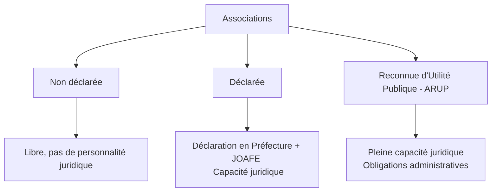
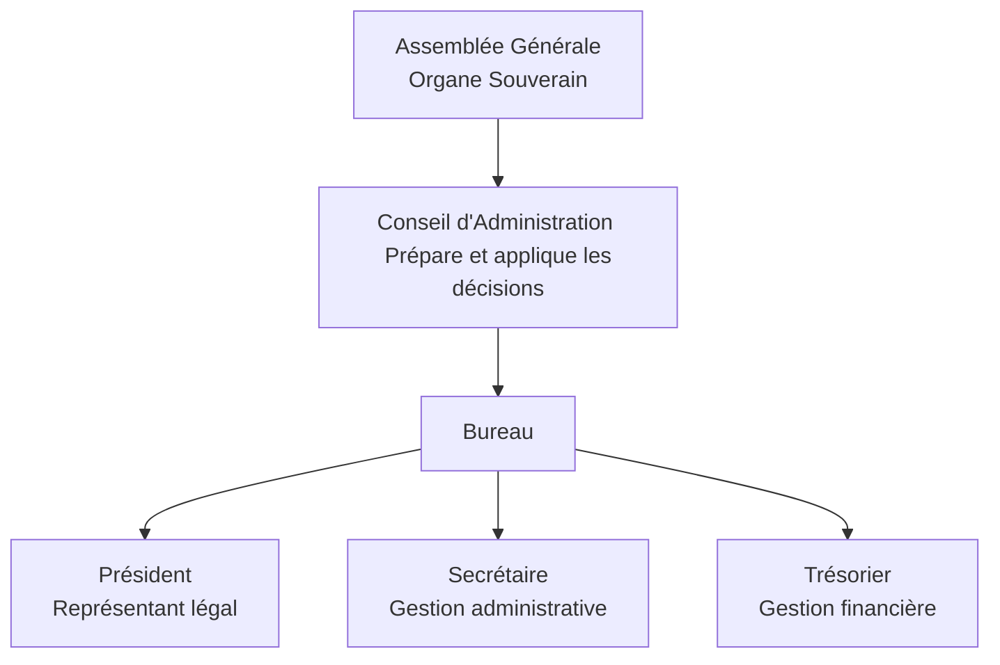
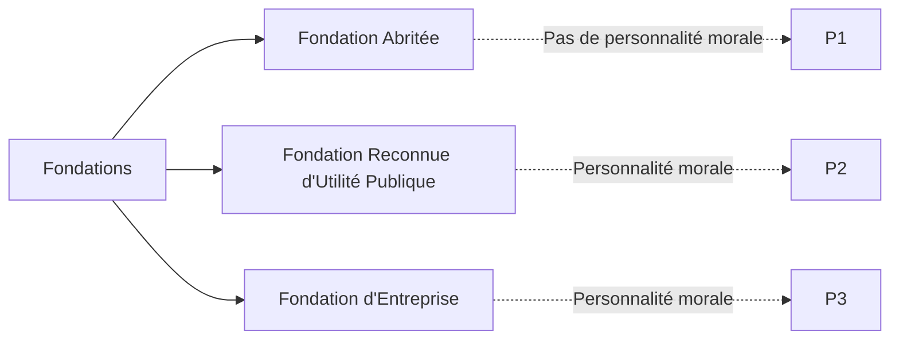

# Fiche de Révision DSCG : Les Groupements Sans But Lucratif (Associations et Fondations)

## PARTIE I : LES ASSOCIATIONS (Loi du 1er juillet 1901)

### 1. Définition et Typologie
L'association est un contrat par lequel deux ou plusieurs personnes mettent en commun, d'une façon permanente, leurs connaissances ou leur activité dans un but autre que de partager des bénéfices.

**Typologie des associations :**

### 2. Constitution : Conditions de fond et de forme

#### A. Conditions de fond
- **Membres** : Personnes physiques ou morales. Différentes catégories : Fondateurs, Actifs/Adhérents, D'honneur, Bienfaiteurs.
  - *Retrait* : Libre en tout temps (toute clause contraire est nulle).
- **Mise en commun** : Permanente, sans subordination, sans rétribution (sauf tolérance limitée pour dirigeants).
- **Activité et Objet** : Libre mais licite (pas contraire aux bonnes mœurs ou à l'ordre public). Possibilité d'activité lucrative, MAIS absence de partage de bénéfices.
  
> [!NOTE] Rappel DCG : Nullité et requalification
> Si l'association partage des bénéfices, elle risque la requalification en société créée de fait, entraînant la responsabilité illimitée et solidaire (si objet commercial) de ses membres. Un objet illicite entraîne la nullité absolue du contrat d'association.

#### B. Conditions de forme
- **Les Statuts** : Liberté contractuelle. 
- **Le Règlement intérieur** : Facultatif, pour préciser le fonctionnement sans modifier les statuts.
- **Déclaration et Publication** : Déclaration à la Préfecture (ou Sous-Préfecture) + Publication au Journal Officiel (JOAFE) dans le délai d'1 mois. Conditionne l'acquisition de la personnalité juridique.

### 3. Effets de la création et Ressources

L'association acquiert la capacité juridique ("capacité de spécialité" limitée à son objet statutaire). 
Elle peut agir en justice, avoir un nom/sigle, et un patrimoine.

| Ressources Internes (Adhérents) | Ressources Externes (Tiers) |
| :--- | :--- |
| - Apports (sans droits sociaux)   - Cotisations (ressource principale)   - Droits d'entrée | - Dons manuels   - Subventions publiques   - Mécénat (Parrainage)   - Quêtes, collectes (autorisation préalable)   - Tombolas, lotos (sous conditions)   - Activités lucratives (accessoires) |

*Cas des ARUP* : Possibilité de recevoir des donations notariées et des legs (testaments).

### 4. Fonctionnement et Gouvernance

La gouvernance est librement fixée par les statuts. Seule obligation légale : déclarer les personnes physiques en charge de l'administration.

#### A. L'Assemblée Générale (AG)
Organe souverain (actes hors administration courante, modifications statutaires, nomination/révocation des dirigeants, dissolution).

> [!NOTE] Rappel DCG : Quorum, Majorités et Procédures de vote
> - **Quorum** : En principe, aucun quorum n'est exigé, sauf clause contraire des statuts.
> - **Majorités** :
>   - *Unanimité* : requise pour la modification des clauses primordiales (ex: l'objet de l'association).
>   - *Majorité simple* (des présents/représentés) : pour les décisions ordinaires ou modifications statutaires non primordiales (sauf statuts contraires).
> - **Vote** : 1 membre = 1 voix. Le vote par procuration est de droit (sauf interdiction statutaire).

#### B. Les Dirigeants et leurs Responsabilités

| Type de Responsabilité | Application aux dirigeants |
| :--- | :--- |
| **Civile (RC)** | - *Envers l'association* : Fautes de gestion ayant causé un préjudice.   - *Envers les tiers* : En principe, l'association est responsable. Le dirigeant engage sa RC s'il commet une **faute détachable** de ses fonctions. |
| **Pénale** | - Infractions dont ils sont auteurs, coauteurs ou complices.   - Exonération possible par *délégation de pouvoirs*.   - Ex: Non-déclaration des modifications, organisation d'insolvabilité, abus de confiance. |
| **Financière** | Supportée par l'association en principe. Le président (ou dirigeant) répond des dettes s'il s'est porté caution ou en cas de faute grave de gestion (ex: insuffisance d'actif en liquidation judiciaire). |

#### C. Contrôle (Commissaire aux comptes)
Nomination obligatoire d'un CAC (titulaire + suppléant) notamment pour : 
- Associations ayant une activité économique et dépassant 2 des 3 seuils (50 salariés, 3,1 M€ CA HT, 1,55 M€ Total Bilan).
- Subventions publiques ou dons du public ouvrant droit à un avantage fiscal > 153 000 €.
- Associations émettant des obligations, organismes de formation d'une certaine taille, etc.

### 5. Dissolution et Liquidation

**Causes de dissolution :**
- **Volontaire** : Arrivée du terme, réalisation/extinction de l'objet, décision de l'AG.
- **Sanction / Judiciaire** : Objet illicite, justes motifs (mésentente paralysant le fonctionnement), déclaration irrégulière, liquidation judiciaire (l'association est soumise aux procédures collectives).

**Liquidation :**
La personnalité morale survit pour les besoins de la liquidation.
- *Boni de liquidation* : Ne peut **jamais** être attribué aux membres de l'association. Dévolu à une autre personne morale à but non lucratif (autre association, fondation, etc.), déterminé par les statuts ou l'AG.

---

## PARTIE II : LES FONDATIONS

### 1. Notion et Typologie
La fondation est l'acte par lequel une ou plusieurs personnes décident **l'affectation irrévocable de biens**, droits ou ressources à la réalisation d'une **œuvre d'intérêt général et à but non lucratif**. (Loi du 23 juillet 1987).

*Caractéristiques clés :*
- Pas de membres (contrairement à l'association). C'est une masse de biens affectés.
- L'affectation est **irrévocable**.
- Nécessite une dotation (masse initiale).

### 2. La Fondation Abritée
Ne dispose pas de la personnalité morale. C'est une libéralité avec charge (legs ou donation) consentie par un fondateur à une personne morale (ex: FRUP, collectivité) qui va "abriter" la fondation.
- **Gestion** : Par la personne abritante, qui doit respecter l'affectation.
- **Révision de la charge** : Possible en justice par le gratifié, 10 ans après le décès du fondateur ou une précédente révision, si exécution devenue extrêmement difficile ou sérieusement dommageable (ex: nouvelles normes de sécurité trop coûteuses).

### 3. La Fondation Reconnue d'Utilité Publique (FRUP)
Créée pour recevoir/gérer une dotation, la FRUP nécessite une **autorisation administrative** (Décret en Conseil d'État) pour exister (reconnaissance d'utilité publique).
- **Constitution** : Dotation suffisante requise. Statuts conformes aux modèles du Conseil d'État.
- **Gouvernance** : Pas d'AG (pas de membres). Gérée par un Conseil d'Administration (ou Directoire/Conseil de Surveillance).
- **Capacité** : Peut recevoir des donations et legs (sans autorisation préalable de l'administration depuis 2006).
- **Tutelle** : Contrôle de l'État (Préfet, Ministère, présence de représentants de l'État).

### 4. La Fondation d'Entreprise
Créée par des sociétés (civiles/commerciales), EPIC, mutuelles. Outil de mécénat et de communication.
- **Création** : Autorisation préfectorale publiée au JOAFE. Dotation initiale non obligatoire (simples engagements pluriannuels de versements suffisent).
- **Durée** : Déterminée (minimum 5 ans).
- **Capacité** : Limitée. Ne peut pas faire appel à la générosité publique, ni recevoir de legs/dons (sauf dons effectués par ses salariés, mandataires sociaux, et actionnaires de l'entreprise/du groupe).
- **Obligations** : Bilan, Compte de Résultat, Annexe + CAC (titulaire et suppléant) obligatoires.
- **Dissolution** : Arrivée du terme, décision des fondateurs, retrait de l'autorisation. Les reliquats vont à un établissement public ou FRUP d'activité analogue.

---

### Tableau de Synthèse Comparatif

| Caractéristiques | Association Déclarée | FRUP | Fondation d'Entreprise |
| :--- | :--- | :--- | :--- |
| **Nature** | Groupement de personnes | Masse de biens affectés | Outil de mécénat pour sociétés |
| **Création** | Libre (Déclaration Préfecture) | Décret en Conseil d'État | Autorisation Préfectorale |
| **Dotation initiale** | Non requise | Requise (suffisante) | Non (engagements de versements) |
| **Gouvernance** | AG, CA, Bureau | CA (ou Directoire/CS) - Pas d'AG | CA - Pas d'AG |
| **Dons et Legs** | Uniquement dons manuels (sauf ARUP) | Capacité à recevoir dons et legs | Interdit (sauf internes à l'entreprise) |
| **Durée** | Libre (ou déterminée) | En principe illimitée | Déterminée (minimum 5 ans) |
