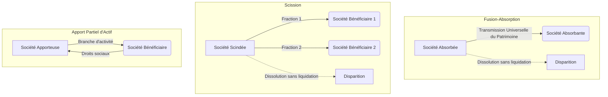

# Fiche de Révision DSCG : Les Restructurations d'Entreprises

Les opérations de restructuration (fusions, scissions, apports partiels d'actif) sont des outils stratégiques majeurs pour la croissance, la compétitivité et la réorganisation des groupes. Elles impliquent des enjeux juridiques, financiers et sociaux complexes abordés au programme du DSCG.

## 1. Définitions et Typologie des Opérations

- **La Fusion (art. L. 236-1)** : Opération par laquelle deux ou plusieurs sociétés se réunissent pour n'en former qu'une seule. 
  - **Fusion-absorption** : La plus fréquente, une société puissante (absorbante) absorbe une ou plusieurs autres (absorbées).
  - **Fusion par création** : Les sociétés disparaissent pour former une nouvelle entité juridique.
- **La Scission (art. L. 236-18)** : Partage du patrimoine d'une société (scindée) en plusieurs fractions simultanément transmises à des sociétés existantes ou nouvelles.
- **L'Apport Partiel d'Actif (APA) (art. L. 236-27)** : Opération par laquelle une société fait apport d'une branche complète d'activité à une autre société et reçoit des droits sociaux en contrepartie. Ne génère pas la dissolution de l'apporteuse.

## 2. Le Contrôle des Concentrations
Les opérations d'envergure font l'objet d'un contrôle concurrentiel pour éviter les abus de position dominante.

- **Contrôle National (Autorité de la Concurrence)** :
  - CA total mondial > 250 M€ HT **ET** CA réalisé en France par au moins deux des sociétés > 80 M€ HT.
- **Contrôle Communautaire (Commission Européenne)** :
  - CA total mondial > 5 Milliards € **ET** CA réalisé dans l'UE par au moins deux des entreprises > 250 M€ HT (faisant échec aux règles nationales).

## 3. Ingénierie Financière : Évaluation et Parité

L'enjeu financier majeur est la détermination de la **parité d'échange** permettant de rémunérer les associés de la société absorbée/scindée par des titres de la société absorbante/bénéficiaire.

- **Évaluation** : Valeur mathématique (Actif net), valeur boursière, valeur de rendement, valeur liquidative...
- **Calcul de la parité** : Détermination de la valeur unitaire des titres de chaque société, puis fixation d'un rapport mathématique d'échange (ex: 2 actions A pour 7 actions B).
- **Cas particuliers** :
  - **La prime de fusion** : Différence entre la valeur vénale des apports (actif net apporté) et l'augmentation de capital réalisée par la société absorbante (basée sur la valeur nominale).
  - **Les rompus** : Lorsque la parité ne permet pas un échange rond. Les actionnaires peuvent renoncer à leurs titres, les céder, ou verser une soulte (limitée à **10%** de la valeur nominale des droits attribués).
  - **Les participations croisées/réciproques** : L'absorbante ne peut s'auto-émettre des titres (interdit par l'art. L. 236-3). Solutions :
    - *Fusion Allotissement* : l'absorbante reçoit une fraction de l'actif net à hauteur de ses parts.
    - *Fusion Renonciation* : l'absorbante renonce à l'augmentation de capital à due concurrence.

## 4. Procédure et Information

> [!NOTE] Rappel DCG : Procédure Juridique des Restructurations
> Toute opération implique un formalisme lourd destiné à protéger les associés et les tiers :
> 1. **Projet de fusion/scission** : Document précontractuel (identités, motifs, évaluation actif/passif, parité, soulte, dates d'effet).
> 2. **Publicité** : Dépôt au greffe du TC et parution dans un SHAL (et BALO si offre au public) au moins 1 mois avant l'AG.
> 3. **Le Commissaire à la Fusion/Scission** : Nommé par le Président du TC, son rôle est d'apprécier la pertinence des valeurs et l'équité de la parité. Obligatoire entre sociétés par actions ou SA/SAS et SARL (sauf renonciation unanime).

### Quorums et Majorités des Assemblées Générales Extraordinaires (AGE)

| Forme de la société | Quorum (1ère / 2ème convocation) | Majorité exigée |
| :--- | :--- | :--- |
| **SA** | 1/4 / 1/5 | 2/3 des voix des présents/représentés |
| **SARL** (créées avant 02/08/2005) | Aucun quorum exigé | 3/4 des parts sociales |
| **SARL** (créées après 02/08/2005) | 1/4 / 1/5 | 2/3 des parts sociales |
| **SAS** | Fixé librement par les statuts | Fixée librement par les statuts |
| **SNC** | Selon les statuts | **Unanimité** (sauf clause statutaire contraire) |

*Attention* : L'unanimité s'impose si la fusion entraîne une **augmentation des engagements** des associés (ex: SA absorbée par une SNC).
*Simplification* : L'absorption d'une filiale détenue à **100%** dispense d'AGE pour l'absorbée, de rapport des dirigeants et de commissaire à la fusion.

## 5. Effets des Opérations

### A. Transmission Universelle de Patrimoine (TUP)
- Transmission complète de l'actif et du passif.
- Dissolution sans liquidation de la société disparaissant.
- En cas de scission : les sociétés bénéficiaires deviennent **débitrices solidaires** du passif de la scindée (sans novation).
- Effet juridique à la date de l'immatriculation (création) ou de la dernière AG, mais possibilité d'une **clause de rétroactivité** (limité à l'exercice en cours, inopposable aux tiers).

### B. Sort des Créanciers
- **Créanciers non obligataires** : Droit d'**opposition** (devant le TC) dans les **30 jours** suivant la publicité. Ne bloque pas la fusion, mais le juge peut ordonner le remboursement anticipé ou la constitution de garanties.
- **Créanciers obligataires** : Consultés (assemblée spéciale) ou, à défaut, droit au remboursement judiciaire s'ils n'acceptent pas le changement de débiteur.

### C. Sort des Contrats et du Social
- **Poursuite des contrats** : Principe de continuité (y compris baux commerciaux), sauf clauses *intuitu personae*.
- **Contrats de travail** : Transfert automatique au nouvel employeur (Art. L. 1224-1 du Code du travail) avec maintien de l'ancienneté, de la rémunération et des droits acquis.
- **Instances représentatives (CSE)** : Information et consultation obligatoires. En cas d'APA, transfert des salariés protégés soumis à autorisation de l'inspection du travail.
- **Stock-options** : En l'absence de législation, le traité doit prévoir l'ajustement de la parité pour la levée future d'actions sur la nouvelle structure.

## 6. L'Apport Partiel d'Actif (Spécificités)
- Portant sur une **branche complète et autonome** d'activité.
- Pas de dissolution de l'apporteuse.
- **Option pour le régime des scissions** : Permet la TUP sur la branche (transfert des contrats et des dettes sans accord des cocontractants). Nécessite l'intervention d'un commissaire et une approbation en AGE.
