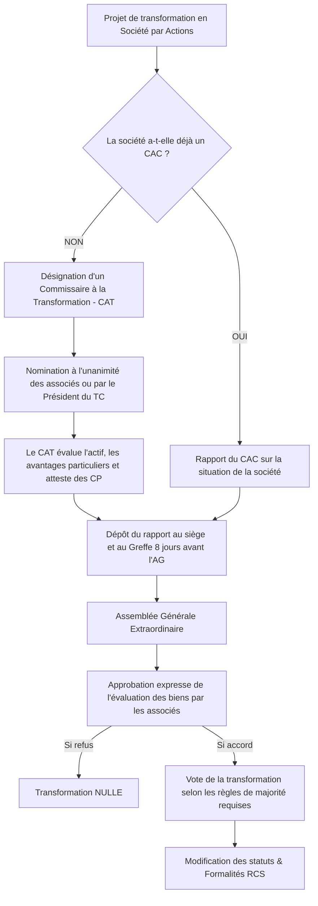

# Fiche de Révision DSCG : La Transformation des Sociétés

## 1. Principes Généraux de la Transformation

La transformation régulière d'une société en une société d'une autre forme **n'entraîne pas la création d'une personne morale nouvelle**. Le principe est celui de la continuité de la personne morale (comme pour la prorogation ou toute autre modification statutaire).

**À ne pas confondre** : Toute modification structurelle n'est pas obligatoirement un changement de forme. 
Par exemple, ne sont pas des transformations (la forme juridique restant dans la même "famille") :
- Le changement de mode d'administration d'une SA (passer d'un Conseil d'Administration à un Directoire et Conseil de Surveillance).
- Le passage d'une société pluripersonnelle à unipersonnelle (SARL ↔ EURL, SAS ↔ SASU).

**Motivations fréquentes de la transformation** :
- **Fiscale** : Optimisation de l'imposition des bénéfices ou des droits d'enregistrement.
- **Sociale** : Changement du régime d'assurance maladie ou de retraite des dirigeants (ex: gérant majoritaire TNS vers assimilé-salarié).
- **Financière** : Volonté de faire une offre au public de titres financiers ou recourir au crowdfunding (nécessite une forme par actions).
- **Mode** : Engouement pour la souplesse de la SAS, par exemple.

---

## 2. La Procédure de Transformation en Société par Actions (SA, SAS, SCA)

### A. L'intervention d'un Commissaire à la Transformation (CAT)
Lorsqu'une société **n'ayant pas de Commissaire aux Comptes (CAC)** se transforme en société par actions, la désignation d'un CAT est **obligatoire**. S'il y a déjà un CAC, un CAT n'est pas nécessaire pour évaluer les biens.

- **Choix et Indépendance** : Choisi parmi les CAC ou les experts inscrits sur les listes judiciaires. Il est soumis aux mêmes règles d'indépendance qu'un CAC.
- **Nomination** : Par accord unanime des associés. À défaut, par ordonnance du Président du Tribunal de Commerce sur requête du représentant légal. Sans CAT, le greffe refusera l'inscription au RCS.

### B. Mission du CAT et Rapports
Le CAT est chargé d'apprécier, sous sa responsabilité :
1. La **valeur des biens** composant l'actif social.
2. Les **avantages particuliers** pouvant exister au profit d'associés ou de tiers.
3. Il **atteste que le montant des capitaux propres est au moins égal à celui du capital social** (à la date du dernier bilan ou d'une situation intermédiaire).

> [!NOTE] Rappel DCG : Transformation d'une SARL
> La transformation d'une SARL en une autre forme exige un **rapport sur la situation de la société**. Si un CAT est nommé (pour un passage en société par actions), ce rapport peut être fusionné avec le rapport sur l'évaluation des biens en un **document unique**.

### C. Approbation par les Associés
- **Délai de communication** : Le rapport du CAT doit être déposé au siège social et au greffe du TC au moins **8 jours** avant l'assemblée.
- **Vote** : Les associés statuent sur l'évaluation des biens (aux conditions de majorité des décisions ordinaires). 
- **Sanction** : À défaut d'approbation expresse mentionnée au procès-verbal, la transformation est **nulle**. 

> [!WARNING] Capitaux propres insuffisants
> Si les capitaux propres sont inférieurs au capital social, l'approbation n'entraîne pas la nullité de la transformation. Toutefois, le greffier refusera probablement l'inscription, et les dirigeants/associés engagent leur responsabilité. Il est recommandé de procéder à une réduction de capital préalable pour apurer les pertes (« coup d'accordéon »).

---

## 3. Schéma de la Procédure de Transformation vers une Société par Actions

---

## 4. Conditions Spécifiques et Règles de Majorité par Forme Cible

> [!NOTE] Rappel DCG : Augmentation des engagements
> Règle d'ordre public : Tout changement de forme entraînant une **augmentation des engagements des associés** (par exemple, passage vers une forme où la responsabilité est indéfinie et solidaire comme la SNC) exige systématiquement **l'unanimité** de tous les associés.

### 4.1. Transformation en Société par Actions Simplifiée (SAS)

La forme SAS offre une grande liberté statutaire, ce qui implique que tous les associés doivent être d'accord pour y souscrire.

- **Condition préalable** : Rapport d'un CAC ou d'un CAT. 2 ans d'existence et 2 bilans approuvés (si la société source était une SA ou SCA).
- **Décision (Quorum / Majorité)** : **Unanimité** des associés ou actionnaires, quelle que soit la forme d'origine.

> [!NOTE] Rappel DCG : Spécificité SAS
> C'est l'un des rares cas où la loi exige formellement l'unanimité pour une transformation qui n'augmente pas financièrement les engagements, en raison du caractère fortement contractuel de la SAS.

### 4.2. Transformation en Société Anonyme (SA)

- **Conditions liées à la forme** : 2 actionnaires minimum, capital social minimum de 37 000 €. Une augmentation de capital préalable peut être nécessaire.
- **Si origine SARL** :
  - SARL créée avant le 04/08/2005 : Majorité des 3/4 des parts (pas de quorum).
  - SARL créée depuis le 04/08/2005 : Quorum 1/4 puis 1/5, Majorité des 2/3 des présents/représentés.
  - *Exception* : Si les capitaux propres dépassent 750 000 €, la majorité simple (moitié des parts) suffit.

### 4.3. Transformation en SARL

- **Conditions liées à la forme** : De 1 à 100 associés. Aucun capital minimum.
- **Conditions préalables (si origine SA/SCA/SAS)** : 2 ans d'existence et 2 premiers bilans approuvés, rapport du CAC sur la situation attestant que Capitaux Propres >= Capital social.
- **Majorité pour la décision** :
  - **Depuis une SA ou SAS** : Majorité des 3/4 du capital. (Quorum pour la SA : 1/4 puis 1/5).

> [!NOTE] Rappel DCG : Clauses statutaires spécifiques
> Dans la SARL comme dans d'autres formes, si les statuts prévoient certaines clauses (inaliénabilité, agrément strict, changement de contrôle), l'unanimité peut être requise pour leur modification concomitante.

### 4.4. Transformation en SNC / SCS

Ces sociétés impliquent une responsabilité indéfinie et solidaire (SNC et commandités de la SCS).

- **SNC** : 
  - **Décision** : **Unanimité** absolue de tous les associés/actionnaires de la société d'origine, car tous deviendront associés en nom collectif avec responsabilité indéfinie et solidaire.
- **SCS** :
  - **Décision** : Accord individuel des associés qui deviennent commandités (responsabilité illimitée), et majorité qualifiée requise par la forme d'origine (ex: 2/3 pour la SA, 3/4 pour la SARL) pour les associés qui deviennent commanditaires (responsabilité limitée).

### 5. Résumé des Rapports Requis

| Société de départ | Société d'arrivée | Rapports obligatoires |
| :--- | :--- | :--- |
| **SARL** | SA, SAS, SCA | Rapport du CAT (si pas de CAC) sur la valeur des biens + Rapport sur la situation de la société (les deux peuvent être fusionnés) |
| **SA / SAS** | SARL | Rapport du CAC attestant que Capitaux Propres >= Capital Social |
| **SA / SAS** | SNC / SCS | Rapport du CAC sur la situation de la société |
