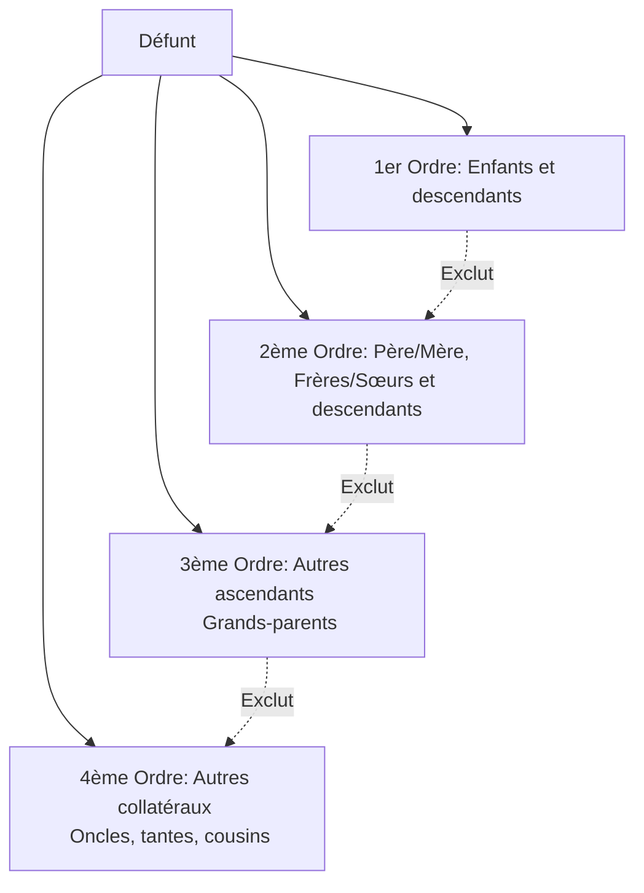

# Fiche de Révision DSCG : La Transmission de l'Entreprise

Cette fiche de synthèse couvre les aspects juridiques et stratégiques de la transmission d'entreprise, qu'elle soit à titre gratuit ou à titre onéreux.

---

## PARTIE I : LA TRANSMISSION À TITRE GRATUIT

### 1. La Transmission Inorganisée (Dévolution Successorale)

En l'absence de testament ou d'organisation préalable, la transmission s'opère selon les règles légales de la dévolution successorale. L'entreprise est traitée comme un ensemble de biens ordinaires.

#### A. Ordres et Degrés de Parenté

La loi classe les héritiers par ordre. Chaque ordre exclut les suivants. Au sein d'un même ordre, le degré le plus proche exclut le plus éloigné (un degré = une génération).

> [!NOTE] Rappel DCG : Quotité disponible et Réserve héréditaire
> Le patrimoine se divise en une **réserve héréditaire** (part minimale garantie aux héritiers réservataires, ex: 1/2 pour un enfant, 2/3 pour 2, 3/4 pour 3 et +) et une **quotité disponible** (part dont le défunt peut disposer librement). Toute libéralité excédant la quotité disponible devra être **réduite**.

#### B. Droits du Conjoint Survivant et des Collaborateurs

**Droits du conjoint successible (non divorcé) :**
| Présence d'autres héritiers | Droits du conjoint survivant |
| :--- | :--- |
| Enfants communs | Choix : Totalité en usufruit **OU** 1/4 en pleine propriété |
| Enfants non communs | 1/4 en pleine propriété obligatoirement |
| Père et Mère du défunt | 1/2 de la succession (chaque parent reçoit 1/4) |
| Un seul parent du défunt | 3/4 de la succession (le parent reçoit 1/4) |
| Aucun descendant ni ascendant | Totalité de la succession |

**Droits des collaborateurs sans statut :**
- **Salaire différé** : Le descendant ayant travaillé sur l'exploitation familiale sans rémunération (au moins 5 ans, > 18 ans) peut revendiquer un salaire différé (max 10 ans) prioritairement sur l'actif successoral.

#### C. Cas Particuliers : Mineurs, Démembrement et Indivision

- **L'héritier mineur** : Il ne peut exploiter un fonds de commerce (incapable) sauf s'il est émancipé et autorisé par le juge. En cas de mise en **location-gérance**, l'autorisation du juge des contentieux de la protection est requise.
- **Entreprise démembrée (Usufruit / Nue-propriété)** :
  - *Fonds de commerce* : L'usufruitier l'exploite mais ne peut le vendre ni en céder les éléments essentiels (clientèle, droit au bail) sans l'accord du nu-propriétaire.
  - *Droits sociaux* : Le nu-propriétaire a la qualité d'associé, mais l'usufruitier a droit aux bénéfices distribués. Les deux doivent être convoqués aux AG et ont un droit de vote.
- **Indivision** : Situation précaire (décisions importantes à l'unanimité, droit de demander le partage).
  - *Sursis au partage* : Le tribunal peut ordonner un sursis de 2 ans maximum pour protéger la valeur de l'entreprise si le partage immédiat risque de la compromettre.

---

### 2. La Transmission Organisée de l'Entreprise

Les techniques d'anticipation permettent d'assurer la pérennité, d'optimiser la fiscalité et d'éviter les conflits.

#### A. Techniques du Droit des Libéralités

- **Donation simple** : Irrévocable (sauf exceptions : ingratitude, etc.). Réduction possible si atteinte à la réserve. Donation progressive possible pour une transition douce.
- **Donation-partage** : Répartit et fige définitivement la valeur des biens au jour de la donation. Évite l'indivision et prévient les litiges familiaux lors du règlement de la succession. Particulièrement efficace pour la transmission de titres sociaux.
- **Pacte Dutreil** : Mécanisme phare de la transmission à titre gratuit des entreprises familiales permettant de bénéficier d'une forte exonération des droits de mutation, sous conditions de conservation des titres et d'exercice de fonction de direction.

#### B. Techniques du Droit des Sociétés

Le but est souvent de **dissocier le capital et le pouvoir**.
- **Aménagement statutaire** : Démembrement des droits sociaux (réserve d'usufruit), création d'actions de préférence (ADP) (ex. : actions à droit de vote multiple pour conserver le contrôle).
- **Société Civile Immobilière (SCI)** : Isoler l'immobilier d'exploitation pour le conserver (et en tirer des revenus locatifs) ou le transmettre indépendamment du fonds.
- **Holding de transmission (LBO familial)** : Apport des titres à une holding. Permet d'optimiser la transmission du capital tout en maintenant le contrôle, souvent en combinaison avec le Pacte Dutreil.

---

## PARTIE II : LA TRANSMISSION À TITRE ONÉREUX

### 1. La Cession de l'Entreprise Individuelle (Loi du 14 février 2022)

Depuis l'entrée en vigueur de la Loi API, le patrimoine de l'EI est séparé de plein droit entre patrimoine professionnel et patrimoine personnel, offrant une étanchéité protectrice.
La transmission peut alors s'opérer par :
1. **La cession universelle du patrimoine professionnel** (transfert global en bloc des biens, droits, obligations et sûretés affectés à l'activité professionnelle).
2. **La vente classique du fonds de commerce**.

### 2. La Vente du Fonds de Commerce

Opération lourde et formaliste visant à protéger le vendeur, l'acheteur et les créanciers. L'élément essentiel transféré est la **clientèle**.

- **Capacité** : Acte de commerce. Un mineur non émancipé ou un majeur sous tutelle ne peuvent accomplir cet acte seuls.
- **Prix** : Doit être déterminé ou déterminable. Ne doit être ni dérisoire, ni fictif.
- **Droit de préemption des communes** : Obligation de notifier les ventes de fonds situés dans un périmètre de sauvegarde du commerce.

> [!NOTE] Rappel DCG : Protection des Créanciers du Vendeur
> Lors de la cession d'un fonds de commerce, les créanciers du vendeur disposent d'un droit d'**opposition** au paiement du prix, ce qui paralyse la remise des fonds au vendeur le temps de régler ses dettes.

### 3. La Cession de Droits Sociaux (Sociétés)

#### A. Préparation et Négociation

- **Audits (Due diligence)** : Indispensables pour évaluer la société cible. Le CSE doit également être consulté.
- **Avant-contrats** :
  - *Lettre d'intention* (cadrage, confidentialité, exclusivité).
  - *Promesse unilatérale de cession/achat* ou *Promesses croisées* (valant vente).
  - *Pacte de préférence (Clause de préemption)* : Engagement de proposer les titres en priorité à un bénéficiaire désigné en cas de volonté de céder.
- **Conditions suspensives** : Clauses conditionnant la perfection de l'acte (ex: obtention d'un financement, agrément, rapport d'audit).
- **Prix (Earn-out ou Clause d'intéressement)** : Une partie du prix de cession est différée et liée aux performances futures de la société cible.

> [!NOTE] Rappel DCG : Clauses d'Agrément
> - **SARL** : L'agrément d'un tiers requiert la majorité en nombre des associés représentant au moins la moitié des parts sociales (sauf majorité plus forte prévue par les statuts).
> - **SA** : La clause d'agrément ne s'applique qu'aux cessions à des tiers et nécessite que les actions soient nominatives et non cotées.
> - **SAS** : Très grande souplesse. La clause d'agrément (et même la clause d'inaliénabilité pour max 10 ans) peut être librement prévue dans les statuts.

#### B. Formalisme de Cession et Opposabilité (Tableau de Synthèse)

| Forme Sociale | Écrit exigé ? | Formalisme de la Cession | Publicité pour opposabilité (RCS) | Transfert de Propriété |
| :--- | :--- | :--- | :--- | :--- |
| **Société Civile** | Oui (à titre de preuve) | Signification au débiteur ou transfert sur le RCS | Modification des statuts | *Solo consensu* (dès l'échange des consentements) |
| **SNC / SARL** | Oui (à titre de preuve) | Dépôt de l'original au siège contre attestation | Modification des statuts | *Solo consensu* (dès l'échange des consentements) |
| **SA / SAS** | Non (libre) | Virement de compte ou Dispositif d'Enregistrement Électronique Partagé (DEEP) | Aucune formalité de publicité | Dès l'inscription en compte ou DEEP |

#### C. Les Garanties de la Cession

En complément des garanties légales, des clauses conventionnelles sont nécessaires lors d'une cession de contrôle :

1. **Garantie légale d'éviction et des vices cachés** : De faible portée dans la cession de titres sociaux, d'où la nécessité de garanties conventionnelles.
2. **Clause de Non-Concurrence** : Le cédant s'engage à ne pas concurrencer la cible. Validité : limitée dans le temps, dans l'espace, proportionnée aux intérêts légitimes, et avec contrepartie financière si le cédant avait un statut de salarié.
3. **Clause de Garantie de Passif** : Protège le cessionnaire en mettant à la charge du cédant toute dette sociale née d'une cause antérieure à la cession, mais révélée postérieurement. (Garantie plafonnée ou illimitée).
4. **Clause de Garantie d'Actif** : Prémunit contre le risque de dépréciation d'un actif figurant au bilan de référence post-cession.
